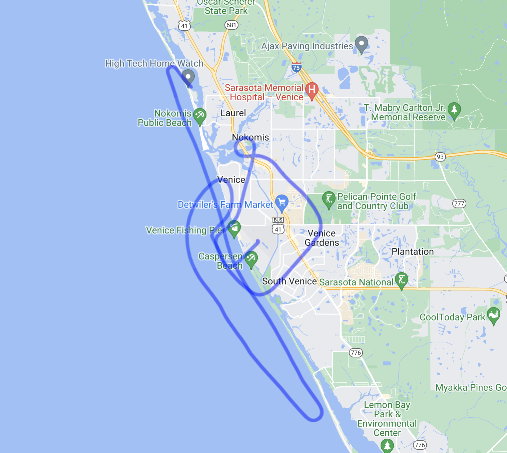

# Dynoxide &emsp; [![Latest Version]][crates.io]

[Latest Version]: https://img.shields.io/crates/v/circadian_tools.svg
[crates.io]: https://crates.io/crates/circadian\_tools

**Still a work in progress and I will break the API in the future**

Dynoxide is a utility for reading Dynon Skyview Black Box data files.

Here's an image of the KML generated from the sample blackbox data:



## Usage

`read_csv_data` takes a path to a blackbox file and returns a vector of `BlackBoxTick` structs. This is the really useful part of the library. The `BlackBoxTick` struct contains all the data from a single tick of the blackbox file, but it has 102 fields so I'm not going to list them all here. You can see the full list in the source code.


I've also added a function to output KML from the black box data. Here's a simple example of how to use the library to generate KML from a blackbox file. The output will load into Google Earth and give you a nice 3D view of your flight.

```
use dynoxide::*;

fn main() {
    let mut data: Vec<BlackBoxTick> = Vec::new();
    let mut rdr = csv::Reader::from_path("flight_data/first_solo_black_box.csv").unwrap();
    for result in rdr.deserialize() {
        data.push(result.unwrap());
    }
    let output_file_name = "sample_out.kml".to_string();
    generate_kml_of_flight(&output_file_name, &data);
}
// Outputs flight path to sample_out.kml
```
